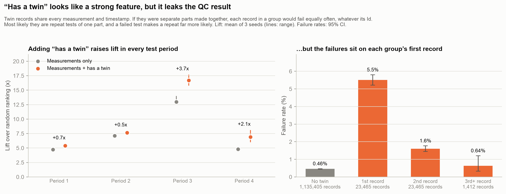
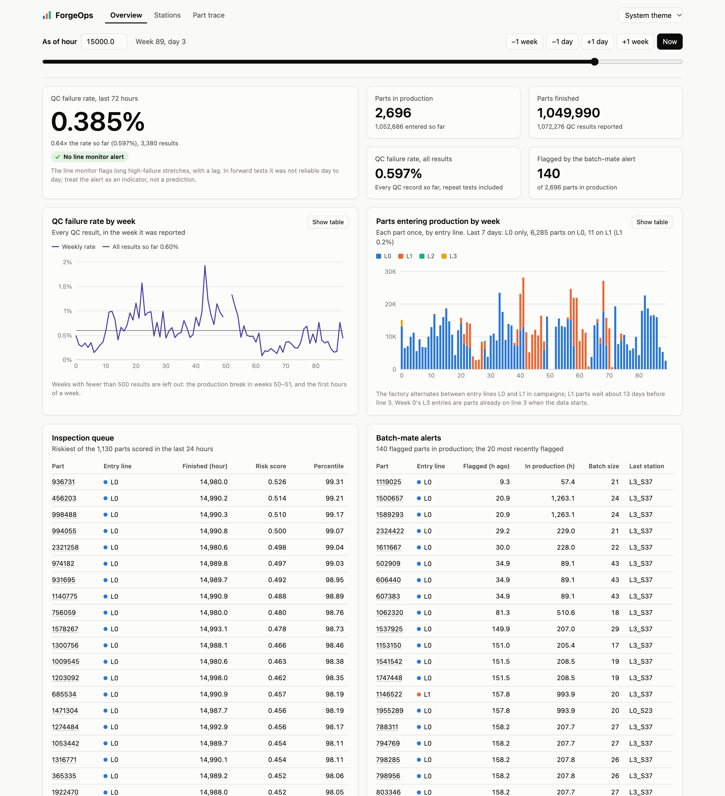
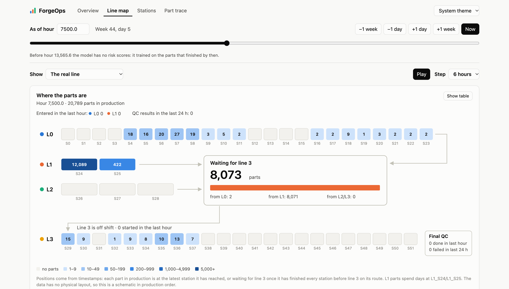

# manufacturingML

Quality-risk analytics on the [Bosch Production Line Performance](https://www.kaggle.com/c/bosch-production-line-performance) data: 1.18M manufactured parts, each with anonymized measurements and timestamps from up to 52 stations on 4 production lines, and a pass/fail result from final quality control (0.58% fail).

The project asks two questions:

1. **Which parts are most likely to fail final QC?** So inspection can focus on them.
2. **How early in production can we tell?** So a part can be pulled before more work goes into it.

Every result below is measured **forward in time**: models train only on parts whose QC result was already known and are tested on parts produced later. On this data, a random train/test split overstates performance by more than 2× (see [Evaluation](#evaluation)).

## Key findings

| | Result |
|---|---|
| **Final-QC triage** | XGBoost on the full measurement record, trained on up to 944k records, reaches **6.3× PR-AUC lift** over random ranking on average (4.3–10.5× across four test periods), counting each part once. Inspecting the 1% highest-risk parts catches **13% of failures** (10–17%). |
| **Early warning from measurements** | **None.** Measurements taken before the final line (L3) predict nothing about future parts. The usable signal arrives at L3, in a part's last ~18 minutes on the line. |
| **Batch-mate alert** | When a part fails final QC, the parts that entered production with it and are still on the line fail more often. Flagging them marks **1.7% of production at 2.6× the average failure rate** and catches 4.4% of failures about **4 days** before final QC, counting each part once. Late flags are stronger while entry line L1 is running, but a cutoff tuned only on past data raises this to just 2.9× (the 4.0× seen in hindsight doesn't hold up). |
| **Production campaigns** | The factory alternates between two entry lines, L0 and L1. Failure rates on both rise and fall together (r = 0.64), and the model ranks L1-entry parts about twice as well (14× vs 6× lift). |
| **A leak that passes a forward split** | About 4% of train records share every measurement and timestamp with another record. "Has a twin" raises lift from 7.4× to 9.2× in every test period, but it leaks the QC result: twins are most likely repeat tests of one part, made after a failed test, and twins hidden in Kaggle's test file confirm it. Not used (see [Evaluation](#evaluation)). |


## What the data looks like

- Column names such as `L3_S33_F3867` mean line 3, station 33, anonymized feature 3867. There are 968 numeric measurements, 2,140 categorical features (not used yet) and 1,156 timestamps.
- Most values are missing, and missing usually means the part never visited that station, so missingness itself carries routing information.
- Timestamps are anonymized. Production activity repeats every 2.4 units (a day) and every 16.8 units (a week), so **1 unit = 10 hours**, with a resolution of 6 minutes. The data spans about two years.
- **Station number is the production order** for every part, so "measurements up to station k" is exactly what was known when the part left station k.
- Parts enter at L0 (median 24 hours on the line) or L1 (median 13 days), may pass through L2, and finish on L3.


## Evaluation

Failures come in bursts. If the part that entered just before a given part failed, that part fails 1.9% of the time instead of 0.54%, and weekly failure rates range from 0.09% to 2.24%. Measurements also carry a fingerprint of when a part was made: a model can tell alternating 4-week periods apart with ROC-AUC 0.96–0.98. A random split therefore lets a model recognise bad weeks instead of bad parts. On the first 500k rows, with the same data for both splits (counting every record):

| Final-QC model | Random split | Forward in time |
|---|---|---|
| PR-AUC lift | 20.0× | 8.7× (mean of 4 test periods) |
| Failures caught in the top 1% | 26.6% | 15.0% |
| …using only measurements from before L3 | 12.1% | 0.8% |

The headline numbers above use all 1.18M parts and count each part once, by its first test. About 4% of records are repeat tests of a part already in the data (see below). Counting them too gave 7.3× lift and 14% top-1% recall, because a model that ranks a failing part high also got credit for its retests ([`one_record_per_part.py`](src/one_record_per_part.py)). Leaving repeats out of training makes no difference, so the model still trains on every record. Repeats inflated the burst numbers even more: a retest enters production with its own part, so a failed part's retest looked like a failing neighbour. Counting every record, the part entering just after a failure seemed to fail 6.6% of the time, and the batch-mate alert seemed to flag at 2.9× ([`burst_one_record_per_part.py`](src/burst_one_record_per_part.py)). The first 500k rows also turned out to be an easier test set than the rest: the same model scores about 9.9× lift on them versus 5.9× on the other parts, so numbers based on the first 500k rows run somewhat high.

`forward_folds()` in [`src/production_data.py`](src/production_data.py) cuts the timeline into five equal blocks and tests on blocks 2–5, each time training on parts that finished before the block began. PR-AUC lift is PR-AUC divided by the failure rate, which is what random ranking would score. Model outputs are **risk scores for ranking**, not calibrated probabilities.

A forward split doesn't catch every leak. About 4% of records are "twins": they share every measurement and timestamp with another record, and they fail 7.5× as often as other records. Adding "has a twin" to the model raises lift from 7.4× to 9.2× and top-1% recall from 14% to 17%, in every test period and with every random seed. But within a twin group the failures sit on the first record: in pairs with one failure, the failing record has the lower Id 95% of the time. Twins are most likely repeat tests of one part, logged with a copy of its production record, and a failed test makes a repeat far more likely. The copied timestamps only make the repeat look simultaneous, so "has a twin" isn't known when a part is first tested. [`twin_feature.py`](src/twin_feature.py) has the details; the feature is not used.

Kaggle split the records between its train and test files at random, so half of all twin pairs straddle the two files. Matching twins across both files ([`kaggle_split_repeats.py`](src/kaggle_split_repeats.py), [chart](results/plots/kaggle_split_repeats.png)) checks the reading out of sample: train records whose twins are all in the test file fail like the twins seen before (first records 6.2% vs 5.7%, later records 1.7% vs 1.7%). Counting them, 4% of train records are repeat tests, parts tested more than once hold 48% of the train file's failures, and parts tested once fail at only 0.33%.



## Setup

```bash
python3 -m venv .venv
.venv/bin/pip install -r requirements.txt
brew install libomp    # macOS only, needed by XGBoost
```

The PySpark ETL also needs Java 17, 21 or 25 (for example Temurin), and the dashboard needs Node.js 20 or later.

Download the competition data from Kaggle into `data/`: `train_numeric.csv`, `train_date.csv`, `test_numeric.csv` and `test_date.csv` (the test files are only used to find repeat tests across Kaggle's split; the categorical files are not used yet). The data is not included here because the competition rules don't allow redistributing it.

## Scripts

Run from the project root, for example `.venv/bin/python src/train_xgboost.py`. Run `kaggle_split_repeats.py` once first: it writes `data/derived/twin_records.csv`, which marks the repeat tests that `train_xgboost.py` and `one_record_per_part.py` leave out of their test sets.

| Script | What it does | Runtime |
|---|---|---|
| [`train_xgboost.py`](src/train_xgboost.py) | Main model: learning curve, final model, inspection-capacity table, results per test period (each part counted once), SHAP explanations; saves the model to `models/` | ~3 min |
| [`analyze_dates.py`](src/analyze_dates.py) | Decodes the timestamps: station order, time unit, timing per station, routes, weekly failure rates | ~20 s |
| [`early_warning.py`](src/early_warning.py) | Trains the model on measurements up to each point in production; compares random split, forward in time and weekly retraining | ~12 min |
| [`burst_monitoring.py`](src/burst_monitoring.py) | How long failure clustering lasts; a line-level QC monitor; the batch-mate alert | ~30 s |
| [`monitor_model.py`](src/monitor_model.py) | Whether monitor features improve the model; the batch-mate alert by when its flag fires | ~3 min |
| [`burst_one_record_per_part.py`](src/burst_one_record_per_part.py) | Re-checks the burst and batch-mate alert numbers counting each part once, against counting every record | ~1 min |
| [`batch_alert_cutoff.py`](src/batch_alert_cutoff.py) | Honest check of the batch-mate alert's cutoff: chosen on past data only, scored on each later period | ~30 s |
| [`campaign_analysis.py`](src/campaign_analysis.py) | L0/L1 entry-line campaigns and the model by entry line | ~2 min |
| [`twin_feature.py`](src/twin_feature.py) | Tests "has a twin" as a model feature, and why it leaks: twin records are most likely repeat tests of one part | ~6 min |
| [`kaggle_split_repeats.py`](src/kaggle_split_repeats.py) | Matches twin records across Kaggle's train and test files: how the split cut twin groups, and an out-of-sample check of the repeat-test reading | ~5 min |
| [`one_record_per_part.py`](src/one_record_per_part.py) | Re-scores the model counting each part once, with and without repeat tests in testing and in training (3 seeds) | ~4 min |
| [`spark_etl.py`](src/spark_etl.py) | PySpark version of the per-part ETL: raw CSVs to Parquet tables in `serving/etl/` (see below) | ~25 s |
| [`check_spark_etl.py`](src/check_spark_etl.py) | Checks the PySpark output against the pandas build, value for value | ~10 s |
| [`twin_validate.py`](src/twin_validate.py) | Digital twin: calibrates [`digital_twin.py`](src/digital_twin.py) on weeks 1–61 and compares its run over the later weeks with the real line | ~40 s |
| [`twin_scenarios.py`](src/twin_scenarios.py) | Digital twin: what-if scenarios and monitor stress tests; saves the line map's twin runs | ~70 s |
| [`twin_scale_data.py`](src/twin_scale_data.py) | Digital twin: the dataset at N times its volume in the Kaggle CSV format, for the Spark ETL | ~2 min at 10x |
| [`eda.py`](src/eda.py) | First exploration on a 10k-row sample; reads `train_numeric.csv` from the current directory | — |

Runtimes are from a Mac with 18 CPU cores and 64 GB of RAM. `train_xgboost.py`, `twin_feature.py` and `one_record_per_part.py` use all 1.18M parts and peak at about 26 GB of RAM (set `NUM_ROWS = 500_000` in `train_xgboost.py` to use less); `kaggle_split_repeats.py` reads both Kaggle files (2.37M records, ~25 GB). The other model scripts use the first 500k rows; analyses that only need timestamps use all 1.18M.

Shared code: [`production_data.py`](src/production_data.py) (loaders, station helpers, twin records, forward-in-time folds) and [`qc_monitor.py`](src/qc_monitor.py) (which QC results were known at a given time).

Outputs go to `results/` (CSVs) and `results/plots/`. `results/random_split/` keeps the original random-split outputs for comparison.

## PySpark ETL

[`spark_etl.py`](src/spark_etl.py) is a PySpark version of the per-part transformations behind the API's data. It reads the raw Kaggle CSVs with explicit schemas and writes two Parquet tables to `serving/etl/`:

- `parts.parquet`: one row per part, with its first and last timestamp, entry line, number of stations visited, whether it went through L2, its path through L3, its QC result and its twin group.
- `station_first_seen.parquet`: when each part first reached each of the 52 stations, in production order.

[`check_spark_etl.py`](src/check_spark_etl.py) compares the output with the pandas build ([`build_serving_data.py`](src/build_serving_data.py)): all 9 columns for all 1,183,747 parts and all 61.5M first-seen values match exactly, missing values included. Twin records get the same keys (every measurement, written out exactly) and the same group numbers.

It runs locally (`local[*]`) in about 25 seconds on an 18-core Mac, against 46 seconds for the same steps in pandas, mostly because Spark parses the CSVs in parallel. At this size one machine is enough either way; the point is a job that would run unchanged on a cluster. At ten times the size (the digital twin's data, below) it takes 51 seconds, where pandas would need about three times this machine's memory. Model scoring stays in Python.

```bash
.venv/bin/python src/spark_etl.py
.venv/bin/python src/check_spark_etl.py    # after build_serving_data.py
```

## API (first version)

A FastAPI service serves the evidence above. Every endpoint answers **as of** a production hour (`at_hour`: hours since the first timestamp; the data is anonymized, so there are no dates) and only uses what was known then: the stations a part had visited, and QC results already reported (1 hour after a part's last station). The risk model only scores parts it never trained on, and ranks each part against parts already scored at that time. Twin records, most likely repeat tests of one part, only appear once the part's QC result is reported; part counts and lists count each part once, while QC result counts and failure rates include every record.

```bash
.venv/bin/python src/kaggle_split_repeats.py  # if data/derived/ doesn't exist yet
.venv/bin/python src/train_xgboost.py         # if models/ doesn't exist yet
.venv/bin/python src/build_serving_data.py    # ~1 min; writes serving/ (~1.2 GB)
.venv/bin/uvicorn api:app --app-dir src       # then open http://127.0.0.1:8000/docs
```

| Endpoint | Returns |
|---|---|
| `GET /summary` | Factory counts so far and the model card (forward-in-time metrics) |
| `GET /line/status` | Line monitor (recent QC failure rate vs. history) and the current entry-line campaign |
| `GET /line/history` | Week by week: QC results reported and their failure rate, and parts entered by entry line |
| `GET /line/map` | Where the parts in production are: at each station, or waiting for line 3 |
| `GET /twin/scenarios`, `GET /twin/map/{run}` | The digital twin's saved runs, and the same map for one of them |
| `GET /parts/{id}` | A part's route so far, status, QC result once reported, batch-mate status, risk, and its twin records once the QC result is reported |
| `GET /parts/{id}/risk` | Risk score, percentile and the top SHAP contributions |
| `GET /inspection-queue` | Parts that just reached their last station, riskiest first, each listed once |
| `GET /alerts/batch-mates` | Parts in production whose entry batch-mate already failed final QC |
| `GET /stations`, `GET /stations/{id}` | Visits, failure rate, risk lift and timing per station |

[`factory_service.py`](src/factory_service.py) holds the logic and returns plain dicts, so the AI-assistant tools below reuse it; [`api.py`](src/api.py) is a thin FastAPI layer with typed response schemas. The tests in [`tests/`](tests/test_api.py) run against the real serving data (`.venv/bin/python -m pytest`) and mostly check that no answer uses information from the future.

## Operations dashboard (first version)

[`dashboard/`](dashboard/) is a React + TypeScript app (Vite, Recharts) on the API. One control sets the production hour, and every page shows the factory as it was known at that hour, so you can replay the line week by week:

- **Overview:** the line monitor's 72-hour failure rate against the rate so far, counts, batch-mate alerts, the inspection queue, and weekly charts of the QC failure rate and of parts entering by line (the L0/L1 campaigns are visible).
- **Line map:** where the parts in production are, station by station and in the queue for line 3, for the real line or a run of the digital twin (below), with play controls.
- **Stations:** the failure rate of the parts that visited each of the 52 stations, with risk lift and timing.
- **Part trace:** a part's route by hours after entry, its status and QC result once reported, its batch-mates, and its risk score with the SHAP contributions behind it.

Risk scores are shown as ranks, never as failure probabilities, and station rates come labelled as associations. Every chart has a legend and a table view; colors follow a palette checked for color-vision deficiency in light and dark mode.



```bash
cd dashboard && npm install && npm run build   # once; the API then serves it
.venv/bin/uvicorn api:app --app-dir src        # from the project root; open http://127.0.0.1:8000/dashboard/
```

For development, `npm run dev` in `dashboard/` serves it at http://localhost:5173 with hot reload and forwards API calls to port 8000. More in [`dashboard/README.md`](dashboard/README.md).

## Digital twin (flow simulation)

[`digital_twin.py`](src/digital_twin.py) simulates the four lines, calibrated on the data. Batches enter every 6-minute tick in copies of real weeks, and each copies a real batch: its parts' routes and their time on lines 0–2 and inside line 3. Line 3 is the shared bottleneck. Each week it plans for the parts that will become ready plus half the gap between its backlog and its usual level: it runs the copied week's shifts, somewhat faster when busy (up to its busiest real weeks' rate), and beyond that adds hours at its usual rate of about 144 parts an hour, up to 123 hours a week; the real line's weekly output follows its hours (correlation 0.96) more than its rate (0.76). It serves L0 work until the oldest L1 part has waited long enough for an L1 block that clears the L1 queue; the real line spends 78% of its running hours on L0 parts only and 22% on L1 parts only. Final QC fails at a route effect (stations visited, entry line) plus batch, hourly and daily line-3 effects, sized so simulated failures cluster like the real ones; repeat tests follow at the observed rates. It is flow only: no measurements, so it reproduces how parts move and how often they fail, not why.

Building it showed that line 3 runs at about 100% of its scheduled hours (demand about 68 parts an hour, scheduled capacity about 67). Its queue, a median 2,700 parts, is where parts spend most of their time: L0 parts wait a median 21 hours for line 3, L1 parts 66 hours.

### Checked forward in time

[`twin_validate.py`](src/twin_validate.py): calibrated on weeks 1–61, run over the rest with the real arrivals and line-3 shift patterns as inputs, and compared on parts that entered in weeks 62–98 (3 seeds):

| | Real | Twin |
|---|---|---|
| Parts finished per week | 10,950 | 10,910 |
| Parts in production, mean / p90 | 5,150 / 15,340 | 7,250 / 16,520 |
| Wait for line 3, median: L0 / L1 parts | 20 h / 68 h | 37 h / 70 h |
| QC failure rate | 0.34% | 0.65% |
| *Given the real failure level:* | | |
| Batch-mate alert: parts flagged / their failure lift | 0.78% / 1.9× | 0.61% / 2.2× |
| Line monitor: share of hours alerting | 14% | 17% |
| Failure lift among parts in the same line-3 tick | 5.8× | 3.3× |

Where it falls short. The real failure rate halved after week 61 (0.69% to 0.34%), which no calibration before then could know; the lower rows give the twin that one number. Later weeks' failures also clustered more than in any calibration week, so the twin underestimates clustering. L1 parts got faster after week 61, so the twin, copying calibration-era L1 routes, keeps them in production longer (p90 694 hours against 390). Its queue runs fuller than the real one (L0 waits 37 hours against 20) because line 3's usual backlog comes from the calibration weeks. Its failure level also drifts like the real one: a single two-year run can sit well above or below the long-run rate.

### What-ifs and monitor stress tests

[`twin_scenarios.py`](src/twin_scenarios.py) uses the twin calibrated on the latest weeks (62–98), replays those weeks, and compares each scenario with the twin's own baseline (3 seeds), so the twin's gaps against the real line largely cancel. Parts that entered in weeks 66–96:

| Scenario | Line-3 hours a week | Line-3 queue, mean / p90 | L0 wait for line 3, median | Parts in production |
|---|---|---|---|---|
| Today | 81 | 3,140 / 5,220 | 27 h | 5,280 |
| Volume +10% | 85 | 3,920 / 7,590 | 39 h | 6,310 |
| Volume +20% | 89 | 5,740 / 14,790 | 45 h | 8,340 |
| Volume +30% | 94 | 8,110 / 21,570 | 61 h | 10,930 |
| Volume +20%, line 3 up to 140 hours a week | 91 | 3,410 / 6,380 | 25 h | 6,010 |
| Line 3 capped at 80 hours a week | 80 | 3,750 / 6,700 | 39 h | 5,880 |
| Line 3 10% slower | 85 | 3,880 / 7,510 | 44 h | 6,010 |
| An L1 campaign in weeks 72–79 instead of L0 only | 89 | 3,110 / 5,590 | 29 h | 7,360 |

Line 3's average hours barely move with volume, but its busiest weeks hit the 123-hour ceiling: at +20% the queue's peaks nearly triple, and allowing 140 hours in those weeks keeps it near today's. An L1 campaign raises parts in production by 40% because L1 parts take about 12 days.

The stress tests inject a quality problem at 20 random times and compare each run with the same seed undisturbed, so every extra failure is known to come from it (an assumed extra risk, not a cause the data shows):

| Injected problem | Extra failures | Line monitor: new alert in time / median hours to it | Batch-mate alert: problem's failures flagged before their QC |
|---|---|---|---|
| Line 3, all parts, 72 h at 2× risk | 20 | 85% / 29 h | 3% |
| Line 3, all parts, 72 h at 3× | 37 | 100% / 28 h | 3% |
| Station L3_S32 only (2% of parts), 72 h at 10× | 12 | 80% / 33 h | 9% |
| Bad material: parts entering in 72 h, 3× | 36 | 65% / 71 h | 2% |
| Bad lots on L0: 20 entry batches at 30× | 29 | 80% / 113 h | 3% |
| Bad lots on L1 during an L1 campaign: 20 batches at 30× | 10 | 15% / 472 h | 17% |

The line monitor (which alerts in about 23% of hours anyway) catches line-wide problems within about a day. The batch-mate alert almost never flags a problem's failures early on L0, where batch-mates go through line 3 together, but flags 17% of bad L1 lots during a campaign, where batch-mates finish days apart: the twin shows why the real alert's lead time comes from L1 campaigns.

### Line map

The dashboard's Line map page shows where the parts in production are: at each of the 52 stations, in the queue for line 3 (by entry line), what line 3 is serving, and final QC, for the real line (`GET /line/map`) or a saved twin run (`GET /twin/map/{run}`), side by side, playing forward an hour, 6 hours or a day at a time. Below, the real line during an L1 campaign: 12,089 L1 parts at L1_S24, 8,071 waiting for line 3, line 3 off shift.



### Data at scale for Spark

[`twin_scale_data.py`](src/twin_scale_data.py) runs the twin over the real production plan ten times end to end (about 19 years), then has Spark copy each simulated part's template timestamps (all 1,156 date columns), shifted to its simulated times, into the Kaggle CSV format: 11.2M parts (9.7× the real data), 27.7 GB of CSV, in 108 seconds. Its routes match the real data's (L1 entries 22.4% against 22.3%, through L2 30.3% against 30.2%, 12.1 stations visited). On it, [`spark_etl.py`](src/spark_etl.py) builds the per-part tables in 51 seconds with Spark's memory capped at 24 GB. The same date steps in pandas take 29 seconds and 18 GB of memory on the real data, so ten times the data would need about 180 GB, almost three times this machine's 64 GB.

```bash
.venv/bin/python src/twin_validate.py     # ~40 s; the first run also builds serving/twin_history.npz (~20 s)
.venv/bin/python src/twin_scenarios.py    # ~70 s; also saves the line map's twin runs to serving/twin/
.venv/bin/python src/twin_scale_data.py --scale 10   # ~2 min, ~28 GB in data/twin_scale/
.venv/bin/python src/spark_etl.py --data data/twin_scale --out serving/etl_scale --files 32 --memory 24g
```

## AI-assistant tools (first version)

[`mcp_server.py`](src/mcp_server.py) exposes the same evidence as 8 read-only [MCP](https://modelcontextprotocol.io) tools: factory summary, line status, part history, risk explanation, inspection queue, batch-mate alerts, and station metrics. Any MCP client can use them. Each tool's description says when to call it, and the server's instructions carry the caveats: risk scores aren't probabilities, the alerts' measured lift, and no calendar dates.

Register it with Claude Code, from the project root:

```bash
claude mcp add forgeops -- "$PWD/.venv/bin/python" "$PWD/src/mcp_server.py"
```

[`assistant.py`](src/assistant.py) is a small command-line assistant on the same tools. It starts the MCP server, hands its tools to Claude (Claude Opus 5.5, through the Anthropic SDK's tool runner), and answers from the tool results. It needs Claude API credentials (`ant auth login`, or `ANTHROPIC_API_KEY`), and each question uses a few cents of API usage.

```bash
.venv/bin/python src/assistant.py "Which parts should we inspect now?"
.venv/bin/python src/assistant.py    # interactive
```

The tests in [`tests/test_mcp_server.py`](tests/test_mcp_server.py) check the tools in process and over stdio, and that they convert into Claude tool definitions, without calling the Claude API.

### Evaluating the assistant

[`evals/assistant/`](evals/assistant/) holds a 46-question eval for the assistant. Each question goes through the assistant's real entry point, and Claude Sonnet 5.5 grades the answer against facts computed from the serving data with the same code the tools call, so the expected answers come from the data, not from a model. An answer passes if it states every required fact, makes none of the case's forbidden claims (such as calling a risk score a probability, giving a calendar date or using data from the future), contains the exact part Ids and names, and every number in it traces back to a tool result. A third of the first 25 questions test limits: unknown or not-yet-entered parts, QC results not reported yet, root-cause and cost questions the data can't answer. The other 21 (tagged `hard`) need counting, sorting or arithmetic over long tool outputs, such as 100 flagged parts or all 52 stations.

Baseline (Claude Opus 5.5; the first 25 questions × 2 runs, the hard 21 × 3): **101 of 113 answers pass (89%)**, 88% of the first set and 90% of the hard set. The hard questions weren't harder: every number they asked for was right in all 63 answers. All 10 real errors were numbers the assistant worked out on its own: 7 that nobody asked for (a count, a time gap, a day of the week, the model's 6.3× lift read as "6× better than random") and 3 forecasts of next week's failures that the tools can't support. One more miss came from a batch-mate counting bug in the API, fixed since. Checking every grade that changed between two grading runs against the data showed the judge gets about 3% of grades wrong, mostly by miscounting. With about 10% of answers failing and run-to-run noise of about ±9 points, the pass rate can't show whether a prompt change helps; that needs a more direct measure of the failure, such as how many numbers per answer the assistant works out itself.

```bash
.venv/bin/python evals/assistant/build_cases.py                       # after build_serving_data.py
.venv/bin/python evals/assistant/run_eval.py --check-grader --reps 3   # every question 3 times, about $13
.venv/bin/python evals/assistant/run_eval.py --tag hard --reps 3       # only the hard questions, about $6
.venv/bin/python evals/assistant/run_eval.py --regrade                 # re-judge saved answers, about $3
.venv/bin/python evals/assistant/review.py                            # grades with the judge's reasons
```

The runner needs Claude API credentials, writes to `.claude/hillclimb/assistant/`, and refuses to run after its own code changes until a person approves it again with `--approve-harness`.

## Status

Done: decoding the data, forward-in-time evaluation, the final-QC model with SHAP explanations, the early-warning, burst-monitoring and campaign analyses, first versions of the API, the AI-assistant tools and an operations dashboard, an eval for the assistant, and a PySpark version of the per-part ETL.

Also built: a flow simulation ("digital twin") of the four lines, checked forward in time, with what-ifs, monitor stress tests, a line map and data at scale for Spark. Planned, not built yet: an AI Analyst page for the dashboard and a station-drift monitor.
