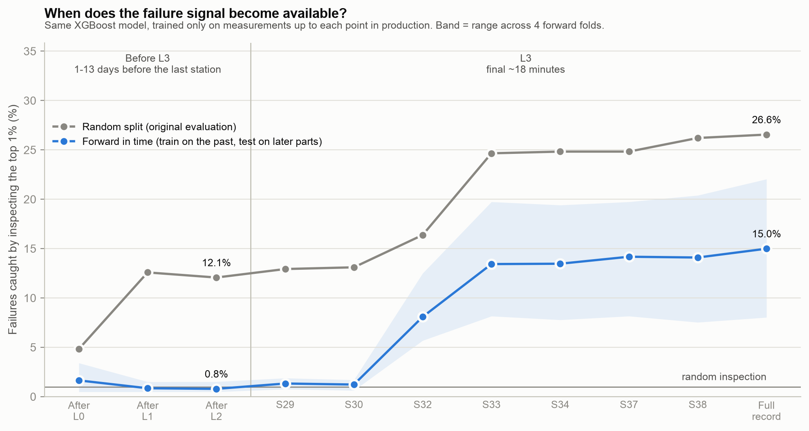
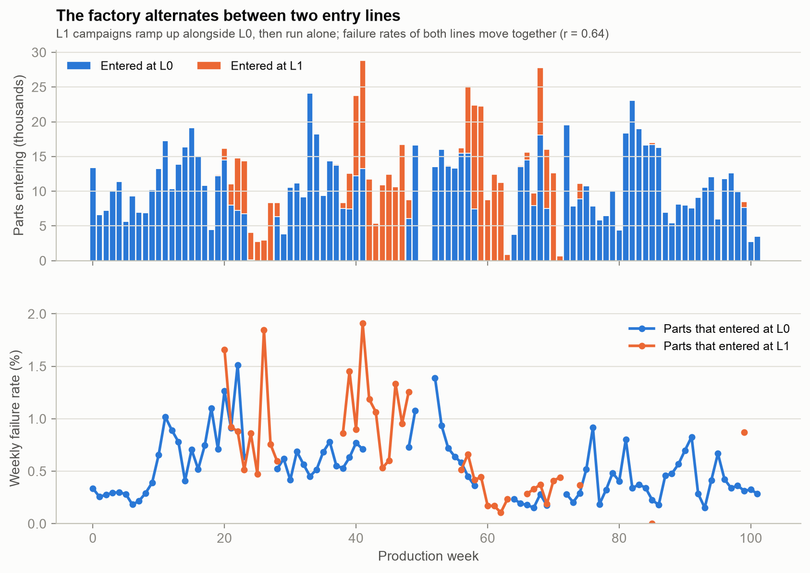

# manufacturingML

Quality-risk analytics on the [Bosch Production Line Performance](https://www.kaggle.com/c/bosch-production-line-performance) data: 1.18M manufactured parts, each with anonymized measurements and timestamps from up to 52 stations on 4 production lines, and a pass/fail result from final quality control (0.58% fail).

The project asks two questions:

1. **Which parts are most likely to fail final QC?** So inspection can focus on them.
2. **How early in production can we tell?** So a part can be pulled before more work goes into it.

Every result below is measured **forward in time**: models train only on parts whose QC result was already known and are tested on parts produced later. On this data, a random train/test split overstates performance by more than 2× (see [Evaluation](#evaluation)).

## Key findings

| | Result |
|---|---|
| **Final-QC triage** | XGBoost on the full measurement record reaches **8.7× PR-AUC lift** over random ranking on average (4.4–16.3× across four test periods). Inspecting the 1% highest-risk parts catches **15% of failures** (8–22%). |
| **Early warning from measurements** | **None.** Measurements taken before the final line (L3) predict nothing about future parts. The usable signal arrives at L3, in a part's last ~18 minutes on the line. |
| **Batch-mate alert** | When a part fails final QC, the parts that entered production with it and are still on the line fail more often. Flags raised at least 3 days after entry mark **0.76% of production at 4.6× the average failure rate**, about **4 days** before final QC. This only works while entry line L1 is running. |
| **Production campaigns** | The factory alternates between two entry lines, L0 and L1. Failure rates on both rise and fall together (r = 0.64), and the model ranks L1-entry parts about twice as well (14× vs 6× lift). |



## What the data looks like

- Column names such as `L3_S33_F3867` mean line 3, station 33, anonymized feature 3867. There are 968 numeric measurements, 2,140 categorical features (not used yet) and 1,156 timestamps.
- Most values are missing, and missing usually means the part never visited that station, so missingness itself carries routing information.
- Timestamps are anonymized. Production activity repeats every 2.4 units (a day) and every 16.8 units (a week), so **1 unit = 10 hours**, with a resolution of 6 minutes. The data spans about two years.
- **Station number is the production order** for every part, so "measurements up to station k" is exactly what was known when the part left station k.
- Parts enter at L0 (median 24 hours on the line) or L1 (median 13 days), may pass through L2, and finish on L3.



## Evaluation

Failures come in bursts. If the part that entered just before a given part failed, that part fails about 6% of the time instead of 0.58%, and weekly failure rates range from 0.09% to 2.24%. Measurements also carry a fingerprint of when a part was made: a model can tell alternating 4-week periods apart with ROC-AUC 0.96–0.98. A random split therefore lets a model recognise bad weeks instead of bad parts.

| Final-QC model | Random split | Forward in time |
|---|---|---|
| PR-AUC lift | 20.0× | 8.7× (mean of 4 test periods) |
| Failures caught in the top 1% | 26.6% | 15.0% |
| …using only measurements from before L3 | 12.1% | 0.8% |

`forward_folds()` in [`src/production_data.py`](src/production_data.py) cuts the timeline into five equal blocks and tests on blocks 2–5, each time training on parts that finished before the block began. PR-AUC lift is PR-AUC divided by the failure rate, which is what random ranking would score. Model outputs are **risk scores for ranking**, not calibrated probabilities.

## Setup

```bash
python3 -m venv .venv
.venv/bin/pip install -r requirements.txt
brew install libomp    # macOS only, needed by XGBoost
```

Download the competition data from Kaggle into `data/`: `train_numeric.csv` and `train_date.csv` (`train_categorical.csv` is not used yet). The data is not included here because the competition rules don't allow redistributing it.

## Scripts

Run from the project root, for example `.venv/bin/python src/train_xgboost.py`.

| Script | What it does | Runtime |
|---|---|---|
| [`train_xgboost.py`](src/train_xgboost.py) | Main model: learning curve, final model, inspection-capacity table, results per test period, SHAP explanations | ~1.5 min |
| [`analyze_dates.py`](src/analyze_dates.py) | Decodes the timestamps: station order, time unit, timing per station, routes, weekly failure rates | ~20 s |
| [`early_warning.py`](src/early_warning.py) | Trains the model on measurements up to each point in production; compares random split, forward in time and weekly retraining | ~12 min |
| [`burst_monitoring.py`](src/burst_monitoring.py) | How long failure clustering lasts; a line-level QC monitor; the batch-mate alert | ~30 s |
| [`monitor_model.py`](src/monitor_model.py) | Whether monitor features improve the model; the batch-mate alert by when its flag fires | ~3 min |
| [`campaign_analysis.py`](src/campaign_analysis.py) | L0/L1 entry-line campaigns and the model by entry line | ~2 min |
| [`eda.py`](src/eda.py) | First exploration on a 10k-row sample; reads `train_numeric.csv` from the current directory | — |

Runtimes are from a Mac with 18 CPU cores and 64 GB of RAM. Models use the first 500k rows; analyses that only need timestamps use all 1.18M rows.

Shared code: [`production_data.py`](src/production_data.py) (loaders, station helpers, forward-in-time folds) and [`qc_monitor.py`](src/qc_monitor.py) (which QC results were known at a given time).

Outputs go to `results/` (CSVs) and `results/plots/`. `results/random_split/` keeps the original random-split outputs for comparison.

## Status

Done: decoding the data, forward-in-time evaluation, the final-QC model with SHAP explanations, and the early-warning, burst-monitoring and campaign analyses.

Planned, not built yet: a station-drift monitor, an API layer, and an operations dashboard.
