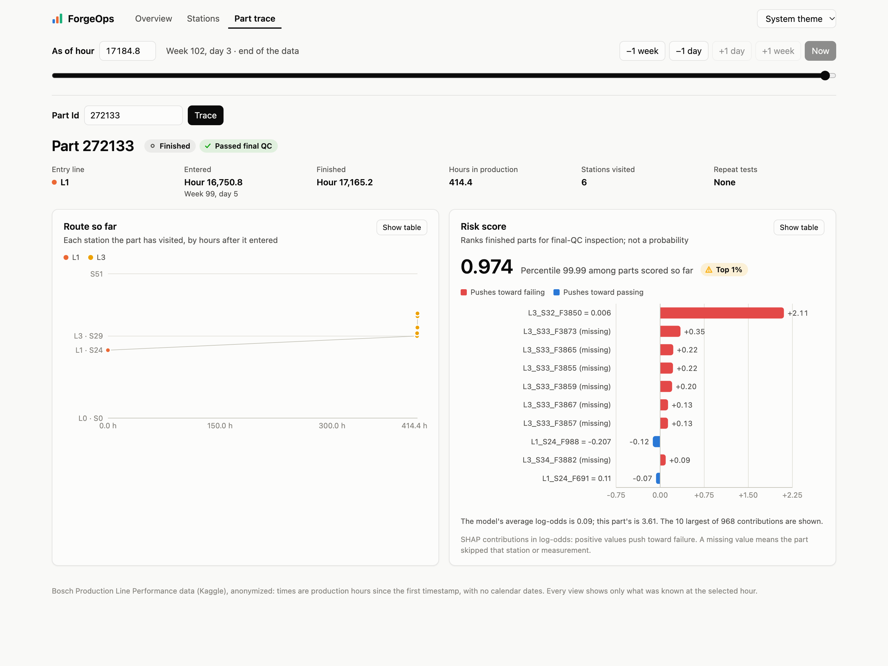

# ForgeOps dashboard

A React + TypeScript app (Vite, Recharts) on the ForgeOps API ([`src/api.py`](../src/api.py)). It has no data of its own: every number comes from the API.

**One time control drives everything.** The bar at the top sets the production hour (hours since the first timestamp; the data has no calendar dates). Every request passes that hour to the API, which answers "as of" it, so each page shows only what was known then. The hour lives in the URL (`#/parts/272133?at=16000`), so any view can be linked to.

| Page | What it shows | API |
|---|---|---|
| Overview | The line monitor's 72-hour QC failure rate, counts, weekly charts of the failure rate and of parts entering by line, the inspection queue, batch-mate alerts | `/summary`, `/line/status`, `/line/history`, `/inspection-queue`, `/alerts/batch-mates` |
| Line map | A schematic of the four lines: parts at each of the 52 stations and in the queue for line 3, what line 3 is serving, final QC. Shows the real line or a saved run of the digital twin (side by side if you like), and plays forward an hour, 6 hours or a day at a time | `/line/map`, `/twin/scenarios`, `/twin/map/{run}` |
| Stations | Failure rate of the parts that visited each station, risk lift, timing, sortable | `/stations` |
| Part trace | Route by hours after entry, status, QC result once reported, batch-mates, risk score with SHAP contributions | `/parts/{id}`, `/parts/{id}/risk` |
| AI Analyst | Questions in plain language, answered by the AI assistant as of the time control's hour; the answer streams in, with every tool call and its result listed under it. A conversation keeps its hour; Stop cancels a run. Each question is billed to the Claude API account the API server is signed in with | `/analyst/status`, `/analyst/ask` |

Lines, stations and products carry illustrative names from `GET /plant` (an ECU plant whose lines behave like the real ones; see the main README), always next to the real codes; the footer says they are illustrative. The twin runs on the line map are simulated parts from `src/twin_scenarios.py` (saved to `serving/twin/`); the page says so and shows each run's description.

Left out on purpose: "predicted failures" (risk scores rank parts; they aren't probabilities), and measurement distributions or anomaly flags (the station-drift monitor isn't built yet).

## Run

Needs Node.js 20 or later and the API's serving data (`src/build_serving_data.py`).

```bash
npm install        # once (about 110 MB in node_modules/)
npm run build      # writes dist/, which the API serves at /dashboard/
```

Then start the API from the project root and open http://127.0.0.1:8000/dashboard/:

```bash
.venv/bin/uvicorn api:app --app-dir src
```

For development, `npm run dev` serves the app at http://localhost:5173 with hot reload and forwards the API's paths to port 8000 (see `vite.config.ts`). `npm run typecheck` runs the TypeScript compiler.

## Layout

```text
src/api.ts            response types (mirror src/api.py) and the fetch helper
src/hooks.ts          useApi (keeps the previous data while reloading), URL routing, theme
src/analyst.ts        the analyst conversation (kept outside the page, so an answer keeps streaming on other pages)
src/theme.ts          chart colors for light and dark mode
src/components/       time control, cards, tables, badges, the charts, a small Markdown renderer for answers
src/pages/            Overview, Line map, Stations, Part trace, AI Analyst
```

## Charts

Colors come from the dataviz skill's reference palette. Lines L0–L3 are blue, orange, aqua and yellow on every chart; the set passes the palette checks for color-vision deficiency in light and dark mode. Aqua and yellow are below 3:1 contrast on the light background, so every chart has a legend and a table view. All-line totals are violet, and SHAP contributions use a blue–red diverging pair (red pushes toward failing). Status badges always pair an icon with a label.


